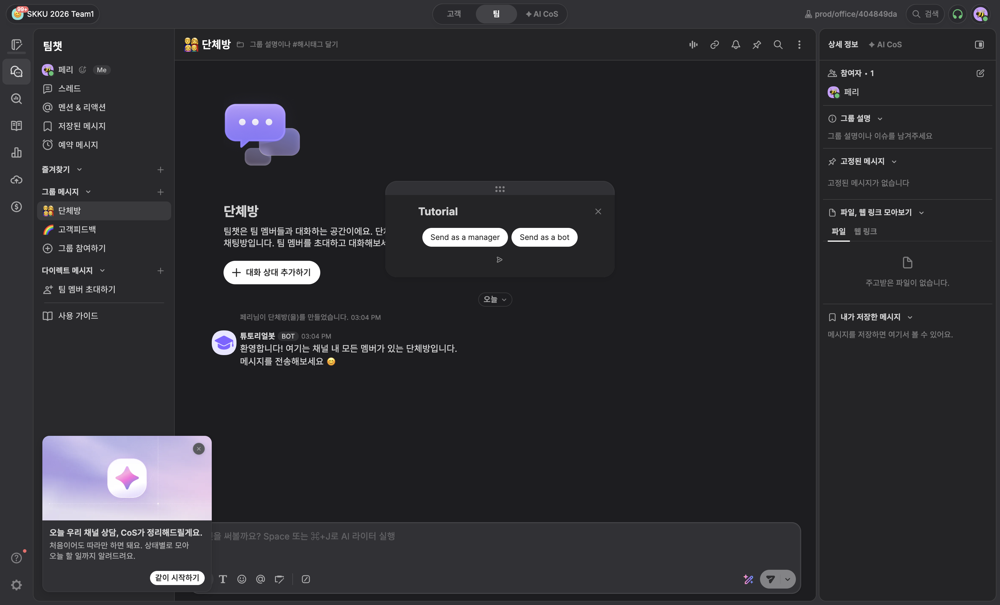

# team1 Desk 검증 기록

검증일: 2026-09-17 · 배포 소스: `c48b7e8` · Worker 버전: `ae4cb3c5-1b7c-498a-8bad-7eac038161b0`

대상은 SKKU 2026 Team1 채널(253286)의 단체방(609174), 앱 `6aab7be513f451690580`입니다.
검증 당시 참여자는 운영진 1명입니다.

## 확인한 항목

- 설치된 앱의 `/tutorial` 커맨드가 Desk 목록에 표시됩니다.
- 그룹 채팅에서 커맨드를 선택하고 실행하면 앱 서버 호출이 HTTP 200으로 완료됩니다.
- Desk WAM 컨트롤러 안에서 실제 배포된 `tutorial` 화면이 열립니다.
- 다크 테마에서 제목과 `Send as a manager`, `Send as a bot` 버튼이 표시됩니다.
- 두 버튼 모두 활성화되어 있으며, 앱 오류 배너는 표시되지 않습니다.
- WAM의 닫기 버튼을 누르면 Desk에서 창이 정상적으로 닫힙니다.
- 검증 전후 채팅 메시지 ID가 같아 새 메시지가 생성되지 않았음을 확인했습니다.
- 해당 실행의 Worker 로그는 outcome `ok`, HTTP 200, CPU 5ms였습니다. 단일 실행 관측값이며 부하 시험은 아닙니다.

## 검증 범위와 남은 항목

실제 메시지를 보내는 두 버튼은 아직 누르지 않았습니다. 따라서 메시지 전송·작성자 구분·전송 후
자동 닫힘까지 확인한 상태는 아닙니다. 대상 방과 고정 테스트 문구를 확인한 뒤 별도로 검증합니다.

- 매니저 경로: `This is a test message sent by a manager.`
- 봇 경로: `This is a test message sent by a bot.`

초기 자동화에서는 비활성 브라우저 탭에서 요청이 지연되다가 종료됐습니다. 탭을 활성 상태로
유지한 재검증에서는 커맨드 HTTP 200과 WAM 렌더링이 확인됐습니다. 앱 코드는 변경하지 않았습니다.

서버·DB·서명 검증·GitHub Actions 배포는 별도로 통과했습니다. 로컬 개발, SQL 마이그레이션,
원격 적용 요청과 배포 절차는 [개발 가이드](../HACKATHON.ko.md)를 참고하세요.
